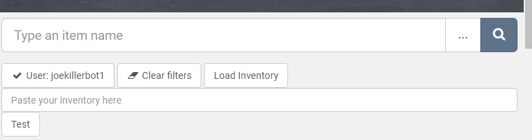
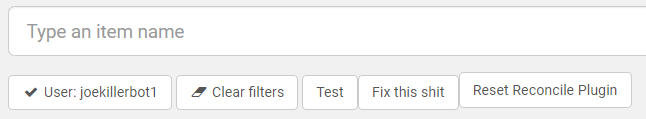

# backpack.tf * Listing Reconcile

The script will help you remove listings which are no longer in your pack. The program ignores
Marketplace listings.

## Installation

_____________________________________________

Use an extension which can execute userscripts (F.e. [Tampermonkey](https://chrome.google.com/webstore/detail/tampermonkey/dhdgffkkebhmkfjojejmpbldmpobfkfo) for [Chrome](https://www.google.com/chrome/) or [Greasemonkey](https://addons.mozilla.org/en-US/firefox/addon/greasemonkey/)  for [Firefox](https://www.mozilla.org/firefox))
and then install using this link: [bptf-listing-reconcile.user.js](https://github.com/joekiller/bptf-listing-reconcile/raw/main/bptf-listing-reconcile.user.js).

(Or paste / install it manually for your plugin)

## Instructions
After enabling the plugin on your classifieds page there will be at least a new button, "Load Inventory"
and a blank field below it that says, "Paste your inventory here". "Load Inventory" will open a new tab
with your TF2 inventory in JSON. Select the whole paste, copy it, and paste it into the field "Paste your inventory here".
Next, click in the blank space by the "Load Inventory Button" which makes it load that field. 
Once it has loaded you can click "Fix" to let it run. The script will run through all your pages and ensure all
listings have a corresponding asset id from your given inventory. When the "Test" button is present, the script
will just alert you to what it would have done. Click the "Test" button to change it to "Live" and then the script
will modify your listings.

If you want to start over, click "Reset Reconcile Plugin". You may want to reload the page as well.

### Example Pictures
Example of initial buttons:

Example of "Test", "Fix", and "Reset" buttons.

## Changelog

_____________________________________________

#### 0.1

* First Release

## Planned features

_____________________________________________

* None
